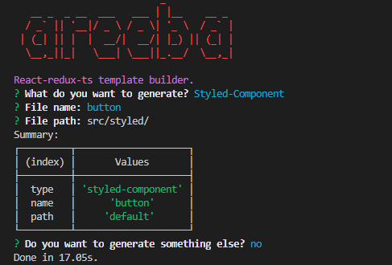

# React Redux TypeScript Template

## Description

This is a React.js template fully written in Typescript. The template is based on [Redux](https://redux.js.org/) for global state management, following the "features" or "ducks" pattern. This pattern enforces that all files for a feature are in the same folder, and that all Redux logic for a feature is in a single file. As a result, the template ommits the old component-container pattern resulting in smaller chunks of code, significantly less file count, easier debugging and limited use of parent-child props.

## Commands

|       command                |                    action                                  |
| :-------------------------:  | :--------------------------------------------------------: |
|     `yarn install`           |    Downloads project dependencies                          |
|     `yarn start`             |    Runs the app in the development mode                    |
|     `yarn test`              |    Launches the test runner in the interactive watch mode  |
|     `yarn build`             |    Builds the app for production to the build folder       |
|     `yarn serve`             |    Starts a static server to serve production build        |
|     `yarn electron-dev`      |    Runs as desktop app in dev mode                         |
|     `yarn electron-pack`     |    Builds desktop app package                              |
|     `yarn cli:install`       |    Downloads the interactive cli dependencies              |
|     `yarn cli:create`        |    Generate template file/s using the cli tool             |

## To Use Template

* Change the current working directory to your local project (optional).
* Go to your project's root directory.
* Run `git remote set-url origin <your new project url>` to link remote project (if applies).
* Inside [`package.json`](package.json), modify the folowing project settings:
    * Set `"name": <your new project name>`
    * Set `"description": <your new project description>` 
* Inside [`public/electron.js`](public/electron.js), set `title: <your project window title>`
* Run `yarn install` to install the dependencies.
* Run `yarn start` to start development server.
* Run `yarn cli:install` to install cli dependencies.
* Run `yarn cli:create` to generate feature files or styled components.
* Edit generated files (read about generated files in the [here](####cli))
* To generate production build files, run `yarn build`

## Production
* Web:

    * run `yarn build` to perform production build. Build files will be generated in a new directory `/build`.
    * run `yarn serve` to serve production build locally

* Desktop:
    Electron-packager supports packaging the React app for multiple desktop platforms (Windows, linux, MacOS). However, packaging for windows requires the extra step of downloading windows-build-tools. 

    * (Windows only): run the global command `npm --add-python-to-path='true' --debug install --global windows-build-tools` (or yarn equivalent) to install windows build tools (run as adminstrator)
    * run `yarn electron-pack` to package as desktop app (This may take time depending on app size and hardware). Build files will be generated in a new directory `/dist`
  
  Note: To test for desktop in dev-mode, just run `yarn electron-dev`.

## Structure

The project root directory structure is as follows:

```
  '|-- <root>',
  '    |-- cli',
  '    |-- public',
  '    |-- readme',
  '    |-- src',
  '        |-- assets',
  '        |-- config',
  '        |-- features',
  '        |   |-- demo',
  '        |       |-- home',
  '        |       |-- landing',
  '        |       |-- login',
  '        |-- locales',
  '        |-- route',
  '        |-- store',
  '        |-- styled',
  '        |-- utils',
  ''
```
As mentioned before, following the "features" or "ducks" pattern organizes the folders in the following manner: 

* [`/cli`](cli)         for the interactive cli that generates project template files.
* [`/public`](public)         for public files
* [`/readme`](readme)         for assets used in [`README.md`](README.md)
* [`/src`](src)            for all source files
* [`src/assets`](src/assets)      for assets (.png, .svg, etc ...)
* [`src/config`](src/config)      for configuration files (colors, headers, strings, etc ...)
* [`src/features`](src/features)    for project features (login, register, dashboard, settings ...)
* [`src/locales`](src/locales)       for i18n localization files (en, ar ...)
* [`src/roure`](src/route)       for router middlewares (protectedRoutes ...)
* [`src/store`](src/store)       for redux configurations (combineReducers, middlewares, persist etc ...)
* [`src/styled`](src/styled)      for multiple use stateless styled components 
* [`src/utils`](src/utils)      for utils used throughout the project 

#### features

As opposed to dividing files into `containers` for logic and `components` for presentation then putting redux logic in a separate folder, this template couples logic, presentation and redux state for each feature separately. Thus, redux state is divided into "slices" where each slice is coupled with a feature. The template also imposes not using own props with connected components.

For example, a login feature contains a slice of the redux state to manage credentials and session, and a component for presenting and submitting the form. 

Example

```ts
// login.slice.ts
import { createSlice, createAsyncThunk } from "@reduxjs/toolkit";

import { Login } from "./login.type";

/**
 * Initial state object
 */
const initialState: Login = {
  email: "",
  isLoggedIn: false,
};

/**
 * Thunks are used to dispatch actions that return functions rather than objects,
 * usually used for making api calls or dispatching async actions.
 * Thunks are dispatched in the same way regular actions are dispatched.
 * A slice can have multiple thunks
 */
const makeLoginApiCall = createAsyncThunk(
  // TODO change this method based on usecase
  // You can add as many thunks as required
  // Delete this method if not needed
  "login/makeLoginApiCallStatus",
  async (body: any, thunkApi) => {
    // Make your API call here
    return {};
  }
);

/**
 * Feature slice Object
 * Automatically generates actions as per reducers
 */
const loginSlice = createSlice({
  /**
   * Unique feature name
   */
  name: "login",

  /**
   * Initial state object
   */
  initialState: initialState,

  /**
   * Reducers are functions that determine changes to an application's state.
   * They can have two forms:
   *
   * 1- Modify the state by providing key-value pairs, ex:
   *
   *    setCounter: (state, action) => {
   *      return { ...state, ...action.payload };
   *    }
   *
   * 2- Apply mutating logic to part of the state.
   *    Note that this is possible using 'Immer', ex:
   *
   *    decrementCounter: (state) => {
   *      state.value -= 1;
   *    }
   */
  reducers: {
    setLogin: (state, action) => {
      return { ...state, ...action.payload };
    },
    reset: () => initialState,
    // Add here reducers
    // ...
  },
  /**
   * Extra reducers are for handling action types.
   * Here thunk actions are handled
   */
  extraReducers: (builder) => {
    // TODO remove extraReducers if there are no thunks
    builder
      .addCase(makeLoginApiCall.pending, (state, action) => {
        // Write pending logic here
      })
      .addCase(makeLoginApiCall.fulfilled, (state, action) => {
        state.isLoggedIn = true;
        state.email = action.payload;
      })
      .addCase(makeLoginApiCall.rejected, (state, action) => {
        // Write failure logic here
        state.isLoggedIn = false;
      });
  },
});

/**
 * Reducers are exported so they could be added to store
 */
export const loginReducer = loginSlice.reducer;

/**
 * Actions hold the same names as reducers.
 * Actions can be dispached using 'useDispacth' hook,
 * or by 'mapDispatchToProps' in the redux 'connect' function
 */
export const loginActions = { ...loginSlice.actions, makeLoginApiCall };

```

```ts

// login.component.tsx
import React, { useEffect } from "react";
import { connect, ConnectedProps } from "react-redux";
import { Input, Button, Form, Card, Checkbox, Col, Row } from "antd";
import { UserOutlined, LockOutlined } from "@ant-design/icons";
import { push } from "redux-first-history";
import { useTranslation } from "react-i18next";

import { RootState } from "&store/store";
/**
 * These are actions imported from the feature slices.
 * You can use 'useDispatch' hook or 'mapDispatchToProps'
 * to dispatch these actions
 */
import { loginActions } from "./login.slice";

type ReduxProps = ConnectedProps<typeof connector>;

const LoginComponent = (props: ReduxProps) => {
  const { logIn, isLoggedIn, push } = props;

  /**
   * i18n translation function.
   * Takes namespace/s as params and nothing for default.
   */
  const { t } = useTranslation(["login"]);

  /**
   * useEffect perfeorms side-effects on component rendering.
   * It takes a function for side-effects and a dependency list.
   * When dependency list is empty, useEffect runs each time the component rerenders
   * Adding variables to the dependency list will cause useEffect to run each time a variable changes
   */
  useEffect(() => {
    // Write your side-effects here
    if (isLoggedIn) {
      push("/home");
    }
  }, [isLoggedIn, push]);

  const handleLoginFormSubmit = (values: any) => {
    logIn(values);
  };

  return (
    <Row justify={"center"}>
      <Col xs={24} sm={24} md={18} lg={8} xl={8}>
        <Card bordered={false}>
          <h1>{t("LOGIN_PAGE")}</h1>
          <Form
            name="normal_login"
            initialValues={{ remember: true }}
            onFinish={handleLoginFormSubmit}
          >
            <Form.Item
              name="email"
              rules={[
                { required: true, message: t("REQUIRED_EMAIL") },
                { type: "email", message: t("VALID_EMAIL") },
              ]}
            >
              <Input
                prefix={<UserOutlined className="site-form-item-icon" />}
                placeholder={t("USER_NAME")}
              />
            </Form.Item>
            <Form.Item
              name="password"
              rules={[
                { required: true, message: t("REQUIRED_PASSWORD") },
                {
                  min: 8,
                  message: t("MIN_LENGTH_PASSWORD"),
                },
              ]}
            >
              <Input
                prefix={<LockOutlined className="site-form-item-icon" />}
                type="password"
                placeholder={t("PASSWORD")}
              />
            </Form.Item>
            <Form.Item>
              <Form.Item name="remember" valuePropName="checked" noStyle>
                <Checkbox>{t("REMEMBER_ME")}</Checkbox>
              </Form.Item>

              <a href="#/">{t("FORGOT_PASSWORD")}</a>
            </Form.Item>

            <Form.Item>
              <Button type="primary" htmlType="submit" block>
                {t("LOG_IN")}
              </Button>
              {t("OR")} <a href="#/register">{t("REGISTER_NOW")}</a>
            </Form.Item>
          </Form>
        </Card>
      </Col>
    </Row>
  );
};

/**
 * Maps state variables from redux store to props of currect component
 * @param state
 */
const mapStateToProps = (state: RootState) => ({
  // Map your redux state to your props here
  isLoggedIn: state.login.isLoggedIn,
});

/**
 * Maps actions from slices to props
 */
const mapDispatchToProps = {
  // map your actions here ex:
  // increment : counterActions.increment
  logIn: loginActions.makeLoginApiCall,
  push,
};

/**
 * Connects component to redux store
 */
const connector = connect(mapStateToProps, mapDispatchToProps);
const LoginComponentRedux = connector(LoginComponent);

export { LoginComponentRedux as LoginComponent };

```


#### styled

#### locales & i18n

This template supports adding internationalization (i18n) for multiple languages. [`i18n.ts`](src/config/i18n.ys) under the [`config`](src/config) folder contains configuration for i18n. The locales provided for this configuration are located under [`locales`](src/locales) folder. Namely, [`locales`](src/locales) include files such as [`en.ts`](src/locales/en.ts) for English and [`ar.ts`](src/locales/ar.ts) for Arabic. The structure of these files is as follows: 

Example

```ts
// ar.ts
import { loginNameSpace } from "&features/demo/login/login.i18n";
import { homeNameSpace } from "&features/demo/home/home.i18n";
import { landingNameSpace } from "&features/demo/landing/landing.i18n";

/**
 * Arabic translation resources.
 * Each object correspond to a namespace related to a feature.
 */
let ar = {
  /** login namespace */
  login: loginNameSpace.ar,

  /** home namespace */
  home: homeNameSpace.ar,

  /** landing namespace */
  landing: landingNameSpace.ar,
};

export default ar;

```
These properties are called *NameSpaces* and based on the project structure, each feature should have its own namespace with translations if it should support localization.

Example

```ts
// login.i18n.ts 

/**
 * i18n login namespace
 * Consists of English and arabic translations
 */
export const loginNameSpace = {
  en: {
    LOGIN_PAGE: "Login Page",
    USER_NAME: "username",
    REQUIRED_EMAIL: "Please input your email!",
    VALID_EMAIL: "Please enter a valid email!",
    PASSWORD: "password",
    REQUIRED_PASSWORD: "Please input your Password!",
    MIN_LENGTH_PASSWORD: "Password should be at least 8 character long!",
    FORGOT_PASSWORD: "Forgot password?",
    REMEMBER_ME: "Remember Me",
    LOG_IN: "Log In",
    OR: "OR",
    REGISTER_NOW: "register now!",
  },
  ar: {
    LOGIN_PAGE: "صفحة تسجيل الدخول",
    USER_NAME: "اسم المستخدم",
    REQUIRED_EMAIL: "الرجاء ادخال البريد الالكتروني",
    VALID_EMAIL: "الرجاء التحقق من صحة البريد الالكتروني",
    PASSWORD: "كلمة المرور",
    REQUIRED_PASSWORD: "الرجاء ادخال كلمة المرور",
    MIN_LENGTH_PASSWORD: "ينبغي ان تتألف كلمة المرور من ثمانية احرف فأكثر",
    FORGOT_PASSWORD: "نسيت كلمة المرور؟",
    REMEMBER_ME: "تذكر بياناتي",
    LOG_IN: "تسجيل الدخول",
    OR: "او",
    REGISTER_NOW: "قم بالتسجيل الان",
  },
};

```
Whenever a new translation namespace file is added for a new feature, it should be specified in locale files under [`locales`](src/locales). 

To use translations inside components, the `useTranslation` hook should be imported and initialized with the component's feature namespace.

Example

```ts
// login.component.tsx

// Importing
import { useTranslation } from "react-i18next";

// Initialization
const { t } = useTranslation(["login"]);

// Usage (LOGIN_PAGE is a key specified in login.i18n.ts file)
 <h1>{t("LOGIN_PAGE")}</h1>

```

#### route

The template uses [react-router-dom](https://reactrouter.com/web/guides/quick-start) for routing between pages, with [redux-first-history](https://github.com/salvoravida/redux-first-history) as middleware to save routing history in redux. The template uses the function called `createHashHistory()` rather than `createBrowserHistory()` for a simple reason: `BrowserHistory` can only be used in browser environments, unlike `HashHistory` which supports browsers and file directories. Since the template can be packaged for multiple platforms (Web, Windows, macOS, linux ...), it needs to use `HashHistory` for routing. The router configuration with redux can be found in [`store.ts`](src/store/store.ts). Navigation to new routes can happen in two ways:

1. Clicking on an anchor link. (Note: since `HashRouter` is used, `href` should be of the form `#/<your specific path>`)

2. Dispatching the `redux-first-history` actions `push`, `replace`, `go`, `goBack`, `goForward` using `useDispatch` hook, or using in `mapDispatchToProps`. (Note: the `pathname` passed to these methods is a regular pathname of the form `/<your specific path>`)

Redux-first-history will be the source of truth for routing location. It changes history based on dispatched actions or when `window.location.url` changes manually. This library has other useful features such as saving up to n previous paths in redux. 

Routes can be found in [`App.tsx`](src/App.tsx) wrapped with the `<Router />` component. In addition to regular routes, the template adds a protected route component [`<ProtectedRoute />`](src/route/protectedRoute.tsx) that directs (or redirects) based on a validation boolean. Exceptionally, a validation boolean and a fallback route are passed as a `prop` to this component to decouple it from Redux and make it usable on its own. The validation boolean coul be the authentication state, while the fallback route is the route used for redirecting in case authentication fails.

Example 

```ts

//App.tsx
import React, { useEffect } from "react";
import { Router, Route, Switch, Redirect } from "react-router";
import { connect, ConnectedProps } from "react-redux";
import { RootState } from "&store/store";
import { Button, Row, ConfigProvider } from "antd";
import { useTranslation } from "react-i18next";
import { History } from "history";

import "./App.css";
import "antd/dist/antd.css";
import { ProtectedRoute } from "&route/protectedRoute";

// TODO remove demo routes
import { HomeComponent } from "&features/demo/home/home.component";
import { LandingComponent } from "&features/demo/landing/landing.component";
import { LoginComponent } from "&features/demo/login/login.component";

type ReduxProps = ConnectedProps<typeof connector>;
type AppProps = {
  /** Browser history for routing */
  history: History<any>;
};

const App = (props: AppProps & ReduxProps) => {
  const { history, isAuthenticated } = props;
  const { i18n } = useTranslation();

  /** This useEffect rerenders dir */
  useEffect(() => {}, [i18n.language]);

  return (
    /* This wrapper handles rtl and ltr directions for i18n */
    <ConfigProvider direction={i18n.dir()}>
      <Router history={history}>
        {/* App main routing switch */}
        <Switch>
          {/* TODO remove the coming demo routes and add your's */}
          <Route exact path="/" component={LandingComponent} />
          <Route exact path="/login" component={LoginComponent} />
          <ProtectedRoute
            exact
            path="/home"
            component={HomeComponent}
            validator={isAuthenticated}
            fallBack="/login"
          />

          {/* TODO This block handles unmatched routes. Add your custom 404 component */}
          <Route path="/404" render={() => <div>page not found</div>} />
          <Redirect to="/404" />
        </Switch>
      </Router>
      {/* This block is for changing language */}
      <Row justify={"center"}>
        <Button onClick={() => i18n.changeLanguage("en")}>en</Button>
        <Button onClick={() => i18n.changeLanguage("ar")}>ar</Button>
      </Row>
    </ConfigProvider>
  );
};

/**
 * Maps state variables from redux store to props of currect component
 * @param state
 */
const mapStateToProps = (state: RootState) => ({
  // TODO change this to your real auth validator
  isAuthenticated: state.login.isLoggedIn,
});

/**
 * Maps actions from slices to props
 */
const mapDispatchToProps = {};

/**
 * Connects component to redux store
 */
const connector = connect(mapStateToProps, mapDispatchToProps);
const AppRedux = connector(App);

export { AppRedux as App };

```

Other customized routing middlewares can be added based on usecases using the same method.

#### utils

This folder includes general util files used throughout the project.


#### cli

The command line tool is used for generating styled components and feature files.

Example



Notice that the `path` option enables nested styled component or nested features. For example, styled components reated to "forms" may all be under the same folder in styled.

* For styled components, the cli tool generates `<filename>.component.tsx` and `<filename>.module.css` template files under `/styled/<customized path>/<filename>`

* For features, the cli tool generates `<filename>.component.tsx`, `<filename>.slice.ts`, `<filename>.type.ts` ,`<filename>.module.css` and `<filename>.i18n.ts` template files under `/features/<customized path>/<filename>`

### path alias

The template supports path aliases to shorten `import` statements. Ex : for accessing a deeply nested module from another, use `&<some module>/<some file>` instead of `../../<some module>/<some file>` and so on.

For adding new path aliases, follow these two steps: 

1. Add `"&<your alias>/*": ["path/to/your/alias/*"]` in [`tsconfig.paths.json`](tsconfig.paths.json)

2. Add `"&<your alias>": path.resolve(__dirname, "path/to/your/alias")` in [`config-overrides.js`](config-overrides.js)

Note:

* You can remove or replace "&" symbol with any other symbol, but make sure to be consistent.

* Reload or restart your IDE or text editor for configurations to appear.


## Project Features

- [Typescript](https://www.typescriptlang.org/) for scalability, code clarity, ease of debugging, etc ... 
- [redux-toolkit](https://redux-toolkit.js.org/) toolset for efficient Redux development
- [redux-persist](https://github.com/rt2zz/redux-persist) to persist and rehydrate Redux store
- [react-i18next](https://react.i18next.com/) for internationalization and localization
- [react-router-dom](https://reactrouter.com/web/guides/quick-start) for routing, with [redux-first-history](https://github.com/salvoravida/redux-first-history) middleware
- [ant-design](https://ant.design/) for responsive high quality reusable components and forms
- [electron-packager](https://github.com/electron/electron-packager) to compile and package as desktop apps
- fully functional components
- cli tool to generate template files that follow project pattern.
- path aliases to reduce import statements' length 

## Note: Demo Files:

To remove demo files:

1. Delete `demo` folder from [`features`](src/features) folder
2. Remove related reducers in the `combineReducers` function in [`rootReducer.ts`](src/store/rootReducer.ts)
3. Remove routes that use demo components in [`App.tsx`](src/App.tsx)
4. Verify that demo namespaces included in locale files under [`locales`](src/locales) folder are removed.
5. Verify that [`App.tsx`](src/App.tsx) does not use demo reducers in connect.


